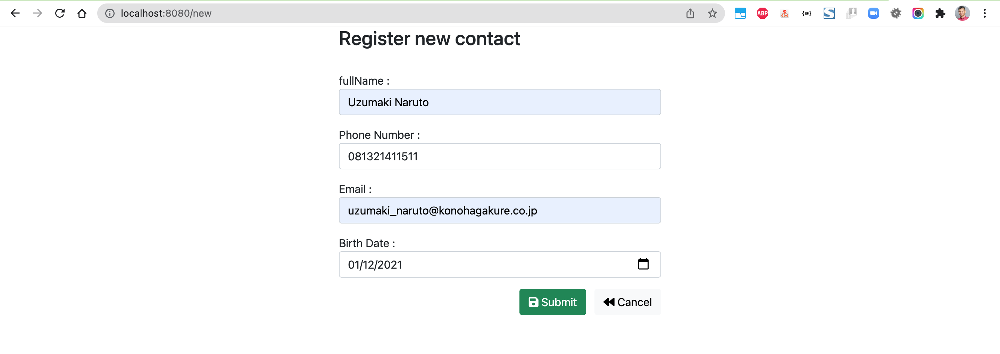
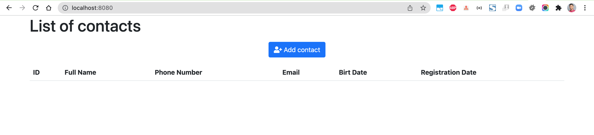
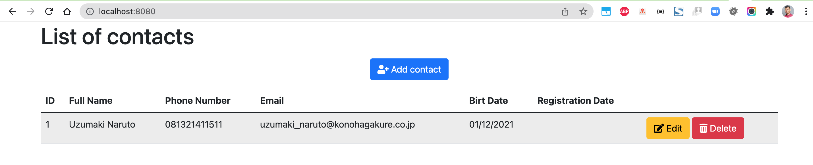
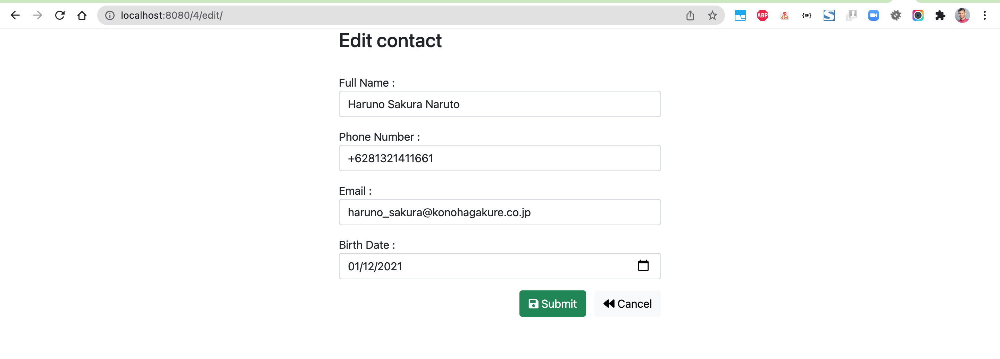
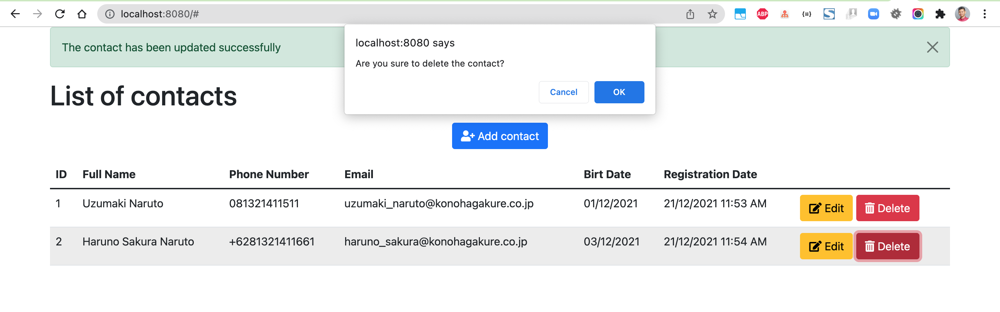
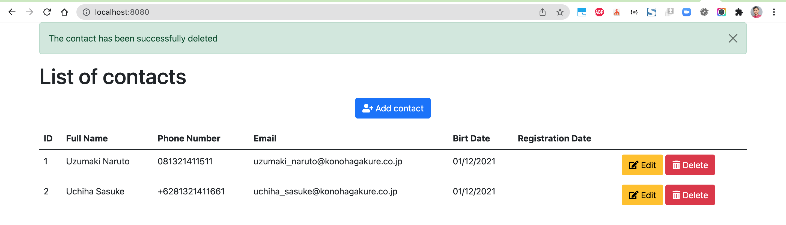

# spring-boot-agenda

### Things todo list:

1. Clone this repository: `git clone https://github.com/hendisantika/spring-boot-agenda.git`
2. Navigate to the folder: `cd spring-boot-agenda`
3. Make sure change your DB credentials in application.properties file
4. Run the application: `mvn clean spring-boot:run`
5. Open your favorite browser: http://localhost:8080

### Images Screen shot

Add New Contact

List All Contacts

Edit Contact

Delete Contact

